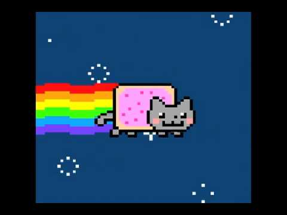
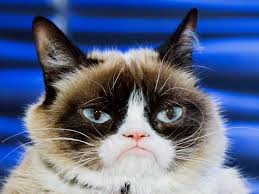
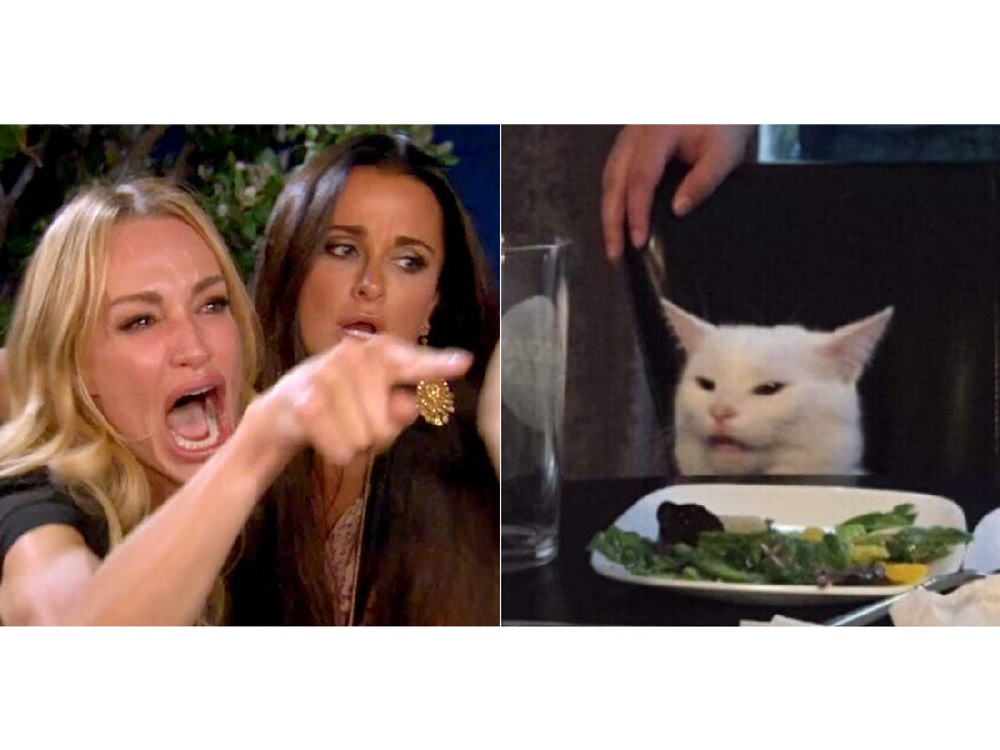
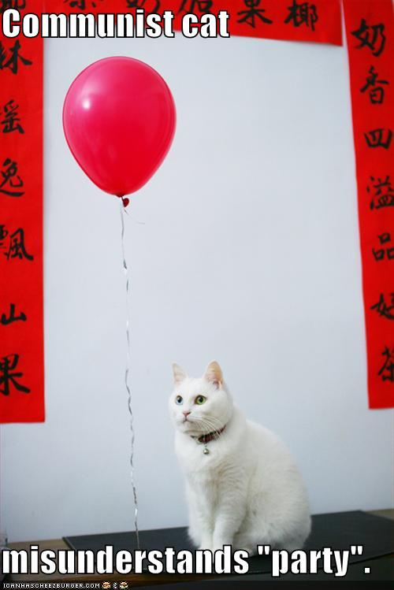

```{r setup, include=FALSE}
knitr::opts_chunk$set(echo = FALSE)
```

```{r}
knitr::opts_chunk$set(echo = FALSE)#set parameters
readname_loc = function()
{ 
  params$locality
  
}
locality=readname_loc()
locality

readname_R0 = function()
{
params$R0
}
R0=readname_R0()
R0

readname_Data_Date = function()
{
  params$Data_Date
}
Data_Date=readname_Data_Date()
Data_Date

readname_Days_Fit = function()
{
  params$Days_Fit
}
Days_Fit=readname_Days_Fit()
Days_Fit

```

# Covid-19 Case Projections for 
```{r}
knitr::opts_chunk$set(echo = FALSE)
print(locality)
```

#### Overview

The Covid-19 Statistics, Policy and Epidemiology Collective (**C-SPEC**) developed a transmission model to project Covid-19 cases in 
```{r}
knitr::opts_chunk$set(echo = FALSE)
print(locality)
```
. Using data available on 

```{r}
knitr::opts_chunk$set(echo = FALSE)
print(Data_Date)
```
, we produced the following estimates for daily and cumulative case counts in
```{r}
knitr::opts_chunk$set(echo = FALSE)
print(locality)
```
under various scenarios. 


## Daily Covid-19 Case Counts 
Projected daily case counts for 
```{r}
knitr::opts_chunk$set(echo = FALSE)
print(locality)
```
, with an R0 of 
```{r}
knitr::opts_chunk$set(echo = FALSE)
print(R0)
```
and without social distancing (see below, **Model Fitting**)

#### Daily Covid-19 Case Counts, **WITHOUT** social distancing


#### Daily Covid-19 Case Counts, **WITH** social distancing



## Cumulative Covid-19 Infections

Here are six scenarios for cumulative case projections over the next 60 days. Scenarios show possibilities for percentage of Covid-19 cases detected in 
```{r}
knitr::opts_chunk$set(echo = FALSE)
print(locality)
```
(5%, 15% or 2% of total cases detected), each considering two percentages of asymptomatic cases (25% and 50%). 

#### Cumulative Covid-19 Case Counts, **WITHOUT** social distancing



#### Cumulative Covid-19 Case Counts, **WITH** social distancing



## Interpretation

These figures reflect the current state of cases reported to 
```{r}
knitr::opts_chunk$set(echo = FALSE)
print(locality)
```
. Please keep in mind that these cases were likely infected around 14 days before becoming symptomatic. Therefore, cases reported to date were likely infected before stringent social distancing measures were established. With continued social distancing, the rate of infection (see below, **Model Fitting**) will likely decrease, and projected infections will likely decrease.

Maintaining social distancing at this stage is crucial to preserving health care capacity, in terms of facilities, equipment, supplies, and workforce. Slowing the rate of infection will alleviate pressure on the daily operations of health care facilities and personnel, in addition to saving lives.

## Outlook

If social distancing decreases the rate of infection by 10% over the next two weeks, daily case counts are projected to improve:

If social distancing decreases the rate of infection by 20% over the next two weeks, daily case counts are projected to further improve:


## Model Fitting

We fitted a dynamic transmission model to data received by 
```{r}
knitr::opts_chunk$set(echo = FALSE)
print(locality)
```
on 
```{r}
knitr::opts_chunk$set(echo = FALSE)
print(Data_Date)
```
. The estimated rate of infection, based on the 
```{r}
knitr::opts_chunk$set(echo = FALSE)
print(Days_Fit)
```
most recent days of data collection, is 
```{r}
knitr::opts_chunk$set(echo = FALSE)
print(R0)
```
. 




#### changing images to plots

## Including Plots

######You can also embed plots, for example:

######```{r pressure, echo=FALSE}
######plot(pressure)
######```

Note that the `echo = FALSE` parameter was added to the code chunk to prevent printing of the R code that generated the plot.
